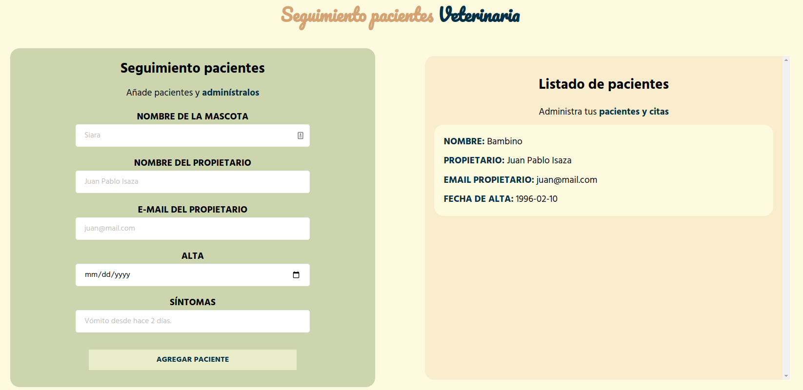

# Veterinary patients follow-up

This is a site developed as a test for a veterinarian's patient follow-up.

Live preview: https://juanisazaveterinaria.netlify.app/

## Table of contents

- [Overview](#overview)
  - [The challenge](#the-challenge)
  - [Screenshot](#screenshot)
- [My process](#my-process)
  - [Built with](#built-with)
  - [What I learned](#what-i-learned)
  - [Continued development](#continued-development)

## Overview

### The challenge

Users should be able to:

- View the optimal layout for the app depending on their device's screen size
- Submit a patient form
- See the list of registered patients

### Screenshot

## My process

### Built with

- CSS custom properties
- Flexbox
- Mobile-first workflow
- ReactJS
